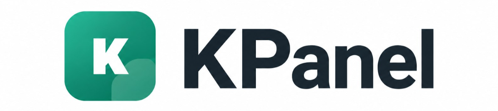
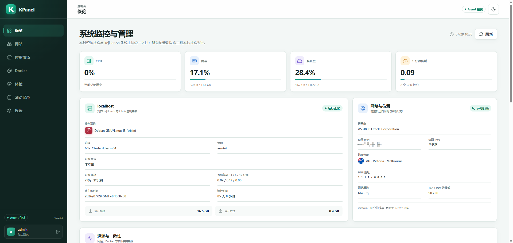
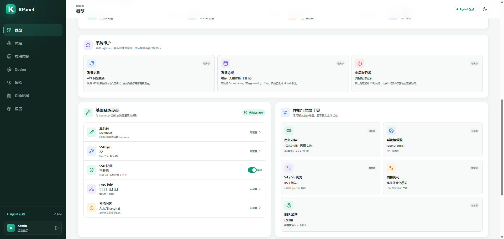
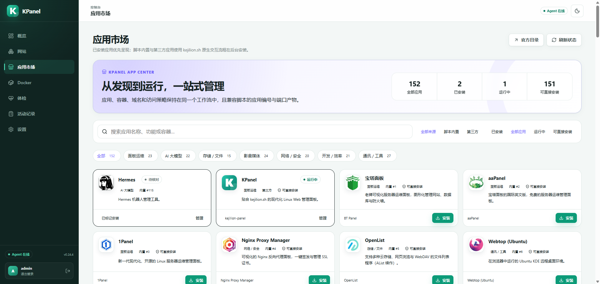

<p align="center">
  
</p>

<p align="center">
  与 <code>kejilion.sh</code> 双向互通的现代 Linux 服务器管理面板
</p>

<p align="center">
  <a href="https://github.com/kejilion/KPanel/releases/latest"></a>
  <a href="https://github.com/kejilion/KPanel/actions/workflows/ci.yml"></a>
  <a href="https://go.dev/"></a>
  <a href="LICENSE"></a>
</p>

<p align="center">
  <a href="#功能概览">功能概览</a> ·
  <a href="#一键部署">一键部署</a> ·
  <a href="#界面预览">界面预览</a> ·
  <a href="docs/deployment.md">部署文档</a> ·
  <a href="docs/session-collaboration.md">协作说明</a> ·
  <a href="#开源许可">开源许可</a> ·
  <a href="CHANGELOG.md">更新记录</a>
</p>

KPanel 将 `kejilion.sh` 的服务器运维能力带到 Web 端。脚本、SSH、Compose
和 KPanel 创建的真实资源可以互相发现、修改并继续管理，避免因为换了管理入口
就失去对现有网站、容器和配置的控制。

KPanel 官方推荐通过 `kejilion.sh` 应用入口一键部署，无需在宿主机安装 Go
或从源码构建。安装完成后，仍可继续使用脚本、SSH 或 Compose 管理同一批真实资源。

## 一键部署

准备一台 Linux 服务器，使用 `root` 用户执行：

```bash
bash <(curl -sL kejilion.sh) app kpanel
```

脚本会自动完成所需组件和 KPanel 的部署。安装完成后，根据终端提示打开面板，
并完成管理员账户初始化。

> [!TIP]
> 图文步骤、功能介绍和使用建议见
> [KPanel 官方部署教程](https://blog.kejilion.pro/kpanel-kejilion-web-server-panel/)。

支持 `amd64` 和 `arm64`。正式支持范围及发行版差异见
[宿主机系统兼容矩阵](docs/platform-support.md)。需要审查构建产物、固定镜像 digest
或进行开发者部署时，请使用[完整部署文档](docs/deployment.md)。

> [!IMPORTANT]
> KPanel 具备宿主机管理能力。请只在可信服务器上使用官方部署入口，并在操作重要网站、
> 数据库和容器前做好备份。

## 界面预览

### 系统监控与管理



### 系统维护与基础设置



### 应用市场



## 功能概览

- **主机总览与系统管理**：查看 CPU、内存、磁盘、负载、网络、服务状态，管理主机名、
  SSH 端口与防御、DNS、时区、Swap、软件源、内核预设、BBR、BBRv3、系统更新与系统清理。
- **AI 运维助手**：使用多 Provider、多模型和多会话工作台，通过固定 KPanel 工具读取真实
  宿主机状态；所有写操作逐次确认，记忆与流程提案经管理员审核后才生效。
- **集群监控**：每台 KPanel 都可同时作为中心端和被控端；主机列表自动包含本机，并通过
  一次性授权码接入其他 KPanel，集中查看 CPU、内存、磁盘、网络、系统和地区概要。支持
  HTTPS，也支持无域名时通过 Noise 端到端加密连接公网 `IP + 端口`；非面板 Linux 主机
  可安装无需 Docker 的只读轻量节点，通过出站 HTTPS 自动上报并自动校验更新。
- **网站管理**：发现现有站点、证书与 Nginx 状态，创建和管理静态站、PHP 站、
  反向代理、负载均衡、域名重定向及常用建站程序；管理 LDNMP 环境的防护、优化、
  更新、备份、还原和卸载。
- **Docker 管理**：统一管理容器、镜像、网络和卷，支持日志、性能采样、更新检查、
  备份还原、SSH 迁移、IPv6 及脚本兼容的访问控制。
- **应用市场**：动态对齐 `app.kejilion.sh`，展示真实安装和容器状态，并为已审计应用
  提供后台安装、实时进度、更新、卸载与失败回滚；专属流程可继续使用脚本交互终端。
- **服务器体检**：运行 IP/解锁、网络线路、硬件性能和综合测评，持续显示脚本来源、
  资源影响、实时日志和历史结果。
- **审计与恢复**：记录管理变更，检测资源版本冲突；配置写入前校验，失败时回滚并明确
  报告未完成的清理项。
- **账户安全**：支持默认关闭、可主动启用的 TOTP 两步验证；提供一次性恢复码、登录限速、
  因素变更后的 Session 吊销和本地加密密钥保护。

## 为什么是 KPanel

- **与脚本互认**：宿主机实际状态是事实来源，面板存储不复制第二套资源真相。
- **不接管现有环境**：安装器不会修改 `kejilion.sh`、`/home/web`、Nginx、防火墙
  或现有站点。
- **权限边界清晰**：Web/API 进程无特权运行，不挂载 Docker Socket 或宿主机根目录；
  宿主机操作由本地 Unix Socket 上的结构化 Agent 执行。
- **来源不限制管理**：脚本、KPanel、Compose 或人工创建的资源，都可以按实际状态
  继续管理。

## 设计与安全

- 不修改、覆盖或 `source` 现有 `kejilion.sh`；需要复用脚本业务时，通过版本化的
  非交互协议调用对应动作。
- 登录、服务端 Session、CSRF、登录限速、可选 TOTP、路径约束与供应链校验属于基础能力。
- 资源来源、KPanel label、脚本 marker、人工修改、危险运行参数或 KPanel 自身身份，
  均不构成管理授权条件。
- 配置写入具备校验、审计和失败回滚；不可逆任务会明确标注并持久化进度与结果。

完整原则见 [PROJECT_RULES.md](PROJECT_RULES.md)、[生态互通基线](docs/ecosystem-parity.md)
与[操作边界审计](docs/operational-boundary-audit.md)。

## 当前边界

Compose/`daemon.json` 通用编辑器、系统重装非交互适配器，以及部分
发行版的 DNS/换源适配器仍在规划中。这些是待实现能力；后续实现仍需经过鉴权、
结构化输入、路径约束、并发控制、审计和失败恢复。

## 项目文档

- 入门与部署：[官方一键部署教程](https://blog.kejilion.pro/kpanel-kejilion-web-server-panel/)、
  [高级构建、发布与部署](docs/deployment.md)、
  [宿主机系统兼容矩阵](docs/platform-support.md)
- 架构与安全：[架构与事实来源](docs/architecture.md)、
  [持久化与数据存储策略](docs/storage-strategy.md)、
  [攻击面与操作边界](docs/security-model.md)、
  [两步验证安全契约](docs/two-factor-authentication.md)、
  [管理员密码恢复](docs/password-recovery.md)、
  [多语言架构与本地化契约](docs/internationalization.md)、
  [性能、稳定性、资源与网络入侵安全开发规范](docs/development-quality-standard.md)
- 生态兼容：[kejilion.sh 兼容基线](docs/compatibility.md)、
  [网站业务分析](docs/legacy-site-contract.md)、
  [应用市场对齐](docs/application-market.md)
- 功能设计：[体检与第三方测试协议](docs/diagnostics.md)、
  [Docker 管理与互通边界](docs/docker-management-v0.18.md)、
  [集群监控与联邦协议](docs/cluster-monitoring.md)、
  [多主机终端安全契约](docs/multi-host-terminal.md)
- 协作规范：[Codex 会话协作](docs/session-collaboration.md)
- 版本信息：[版本变更记录](CHANGELOG.md)

## 开源许可

KPanel 源代码采用
[GNU Affero General Public License v3.0 only](LICENSE)（SPDX：
`AGPL-3.0-only`）。通过网络向用户提供修改版 KPanel 服务时，应按该协议向这些用户
提供对应源码。

Copyright © 2026 kejilion and KPanel contributors.

随 KPanel 分发的 `kejilion.sh` 和其他第三方组件继续使用各自的原始许可，详见
[第三方许可声明](THIRD_PARTY_NOTICES.md)。KPanel 名称和 Logo 的使用边界见
[品牌说明](TRADEMARKS.md)。
