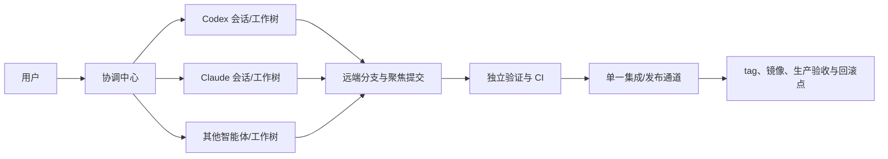

# KPanel 跨智能体协作运行手册

本手册说明 Codex、Claude 及其他智能体如何在同一 KPanel 项目中并行工作。强制规则以
[`project-management.md`](project-management.md) 为准。

## 协作架构



智能体之间不需要读取彼此的私有对话；它们通过 SSH 远端分支、聚焦提交和 CI 交换可验证状态。

## 工具入口

| 工具 | 首个入口 | 专属能力 | 不可作为全局真源的内容 |
| --- | --- | --- | --- |
| Codex | `AGENTS.md` | Codex 任务复用、等待、`.codex-workflows/` | Codex 任务标题、会话 ID、未提交上下文 |
| Claude | `CLAUDE.md` | Claude/Claude Code 会话与本地工具 | Claude 会话历史、Todo、未提交上下文 |
| 其他智能体 | `PROJECT_RULES.md` + 本手册 | 工具自身能力 | 工具私有记忆和聊天记录 |

所有工具共同读取 `PROJECT_RULES.md` 和 `docs/project-management.md`，共同执行仓库的 Make、测试、
CI 和发布入口。

## 标准协作流程

1. 协调中心执行 `git fetch origin --prune`，盘点远端任务分支、worktree 和活跃任务。
2. 任务契约明确 scope、路径声明、基线、风险等级、当前智能体、权限、依赖和验收。
3. 协调中心从最新批准基线创建专用 branch/worktree，并把绝对路径交给唯一写入者。
4. Codex 或 Claude 只在自己的 worktree 写入，阶段结果以聚焦提交保存。
5. 获得推送授权后，智能体通过 SSH 推送同名任务分支，并回传提交哈希、测试和风险。
6. 另一智能体或独立验证任务从远端提交重建环境并复核，不接管原会话的未提交状态。
7. 协调中心批准后进入集成队列；集成/发布任务只接收精确提交清单，并通过 SSH 更新远端。

## 路径声明与冲突判断

开始任务时声明预计修改的文件或目录：

```text
允许：internal/monitoring/**, web/src/components/monitoring/**
禁止：VERSION, CHANGELOG.md, .github/workflows/**
契约依赖：internal/contract/monitoring.go
```

- 两个任务路径完全分离且无共享契约，可以并行。
- 共享 API、Schema、版本文件、依赖锁文件或同一设计文档时，必须定义先后依赖或由一个任务拥有共享文件。
- `VERSION`、`CHANGELOG.md`、Release workflow 和候选分支在发布冻结后只归发布任务所有。
- 实际需要越出声明范围时，先由协调中心重新确认任务契约和冲突，不得直接扩大范围。

## 跨智能体移交模板

```text
任务 scope：<stable-slug>
移交：Codex -> Claude（或 Claude -> Codex）
当前状态：待复核 / 阻塞
基线：<commit>
分支：<branch>
最新提交：<commit>
工作树：clean / dirty（dirty 时列出全部文件）
已完成：
验证命令与结果：
失败或未验证：
允许继续修改：
禁止修改：
建议下一步：
回滚点：
权限：是否允许提交/SSH 推送/更新 main/发布
```

接手者必须先独立执行 `git fetch`、`git status`、`git log` 和差异检查。没有提交的复杂修改默认退回
原智能体完成检查点，不通过复制文件或共享脏工作树交接。

## 推荐分工

- Codex：协调中心、仓库级实施、自动化测试、发布编排。
- Claude：独立设计复核、复杂代码审阅、专项实现或验证。
- 两者可互换；分工不赋予任何模型天然更高的合并或发布权限。
- 同一功能可以采用“Claude 设计/评审 + Codex 实现”，也可以反向；最终以提交、测试和 CI 证据判断。

## 失败处理

- GitHub 插件、Issue、PR、API 或 `gh` 不可访问：不影响 Git 开发；确认 SSH remote 和任务所有权后继续。
- SSH 认证失败：停止远端交付，保留本地提交，修复仓库专用 SSH 凭据后再推送。
- 负责人失联：协调中心确认远端分支、最新提交和工作树后再移交。
- 两个智能体修改同一文件：停止其中一方，分别保存聚焦提交，由集成任务决定顺序和冲突处理。
- 智能体声称完成但无提交或证据：状态保持开发中，不进入集成。
- 发布期间出现新功能：进入下一版本任务分支，不修改冻结候选。
